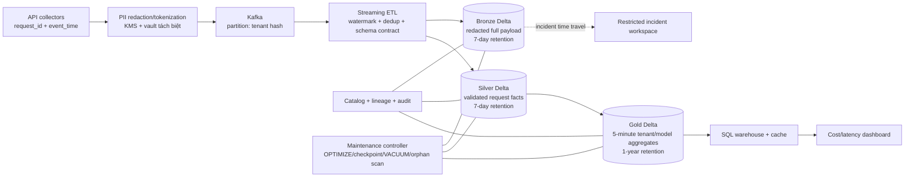

# Architecture Brief — LLM Observability ở quy mô 1B request/ngày

**Tác giả:** Dang The Vinh — 2A202602587 
**Phạm vi:** Topic A, thiết kế cá nhân cho design review 
**Ngày:** 2026-10-05

## 1. Problem statement

Hệ thống phục vụ 1 tỷ LLM request/ngày, trung bình 11.6 nghìn request/giây và thiết kế cho peak 60 nghìn request/giây. Mỗi request tạo khoảng 5 KB log, tương đương 5 TB raw/ngày. Dashboard cost/latency theo tenant phải nhận dữ liệu mới trong 5 phút; prompt/response đầy đủ chỉ được giữ 7 ngày để điều tra incident; aggregate giữ 1 năm; PII phải được redact hoặc token hóa trước khi bất kỳ analyst nào đọc; ngân sách storage không vượt 5.000 USD/tháng.

Điểm khó không chỉ là throughput. Nếu ghi trực tiếp từng micro-batch, số file và metadata tăng nhanh hơn dung lượng hữu ích. Nếu lưu PII vào Bronze rồi mới redact ở Silver, dữ liệu nhạy cảm đã vượt trust boundary. Nếu index/dashboard không nhận delete, bản ghi hết retention vẫn có thể truy hồi. Thiết kế vì vậy phải đồng thời bảo đảm ACID, medallion, schema contract, retention có thể chứng minh, clustering cho filter theo tenant, và quan sát được chi phí.

## 2. Kiến trúc đề xuất

Luồng chính có bốn concept Day 18 được áp dụng cụ thể: Bronze–Silver–Gold; ACID/time travel cho replay và rollback; catalog làm control plane cho quyền truy cập/lineage; clustering và data skipping cho `tenant_id`; thêm maintenance, retention và FinOps như các cơ chế vận hành bắt buộc.

### Data contract và layout

- Event bắt buộc có `request_id`, `tenant_id_token`, `event_time`, `ingest_time`, `model`, token counts, latency, status, region, `schema_version` và payload đã redact.
- Bronze append-only, partition theo `event_date/hour`; target file 256–512 MB. Không partition theo `tenant_id` vì cardinality cao sẽ tạo small files.
- Silver dedup theo `request_id`, giữ event đến muộn với watermark 24 giờ và quarantine record sai schema. Layout partition theo `event_date`, liquid cluster theo `tenant_id_token, model`.
- Gold tạo cửa sổ 5 phút theo tenant/model, lưu `count`, p50/p95/p99, error rate và cost. CDF từ Silver cập nhật Gold theo increment thay vì quét lại 5 TB/ngày.
- Mỗi deployment ghi `pipeline_version`, input table version và output version vào audit table. Incident replay pin version; không dùng “latest” làm bằng chứng.

## 3. Các quyết định chính và alternatives đã loại

| # | Quyết định | Hai alternatives bị loại và trade-off |
|---:|---|---|
| 1 | **Chọn Delta Lake** cho ba tầng vì streaming upsert, transaction log, MERGE, time travel và CDF phục vụ cập nhật Gold/delete propagation. | **Raw Parquet** rẻ và mở nhưng không có transaction/version contract, dễ để dashboard đọc trạng thái nửa commit. **Iceberg** có catalog/partition evolution tốt hơn cho multi-engine, nhưng changelog/update path của đội hiện tại phức tạp hơn; sẽ đánh giá lại nếu Trino/Flink trở thành writer chính. |
| 2 | **Tokenize/redact tại collector trước Kafka và Bronze**; vault ánh xạ token nằm ở security account, analyst không có quyền. | **Redact ở Silver** bị loại vì PII đã tồn tại trong Kafka/Bronze và backup. **Hash không salt** bị loại vì phone/email có không gian nhỏ, dễ dictionary attack và không hỗ trợ controlled re-identification khi incident được phê duyệt. |
| 3 | **Partition thời gian, liquid cluster theo tenant/model**; file target 256–512 MB. | **Partition theo tenant** bị loại vì hàng chục nghìn tenant tạo partition/file explosion. **Chỉ partition ngày, không cluster** đơn giản hơn nhưng dashboard filter một tenant phải đọc quá nhiều file; data skipping kém khi tenant phân tán. |
| 4 | **Gold 5 phút được cập nhật incrementally từ Silver CDF** và phục vụ qua SQL warehouse có cache. | **Dashboard quét Bronze** bị loại vì lặp lại parse/PII logic và scan TB cho mỗi refresh. **Đẩy mọi thứ vào OLTP** bị loại vì percentile/backfill làm cạnh tranh với workload giao dịch và retention một năm không phù hợp. |
| 5 | **Catalog tập trung** quản lý table location, schema, row/column policy, owner và lineage; storage policy không nằm trong notebook cá nhân. | **Path-based tables** bị loại vì ai biết URI có thể bypass naming/policy và khó tìm owner. **Hive Metastore tự quản** bị loại vì thiếu governance/audit tích hợp và tăng on-call burden, dù giảm lock-in. |
| 6 | **Retention hai lớp:** table-aware delete/VACUUM có safety window, sau đó object lifecycle; CDF phát delete tới cache/index. | **Chỉ S3 Lifecycle** bị loại vì có thể xóa file vẫn được transaction log tham chiếu, làm hỏng time travel. **Chỉ VACUUM** bị loại vì không phát hiện mọi orphan chưa từng commit và không tự bảo đảm cache/index đã xóa. |
| 7 | **At-least-once ingest + idempotent dedup bằng `request_id`**, checkpoint và replay. | **Exactly-once end-to-end được tuyên bố tuyệt đối** bị loại vì side effect ngoài transaction boundary vẫn có thể lặp. **At-most-once** bị loại vì mất log làm sai billing và incident reconstruction. |

Lựa chọn liquid clustering phù hợp cột filter cardinality cao và access pattern thay đổi; tài liệu Delta cũng lưu ý đây là feature protocol mới, vì vậy compatibility matrix của reader/writer phải là release gate. CDF chỉ ghi thay đổi từ lúc được bật và dữ liệu CDF đi theo retention của bảng, nên enable ngay khi tạo Silver/Gold, không chờ đến khi có incident.

## 4. Retention, security và vận hành

### Retention contract

- Bronze và Silver: dữ liệu đầy đủ hết hạn sau 7 ngày. Safety delay 24 giờ cho job/reader đang chạy; lệnh vacuum không được dùng retention 0 trong production.
- Gold: 30 ngày gần nhất ở Standard, 335 ngày còn lại có thể sang IA vì dashboard thường xem ngắn hạn; aggregate hết hạn sau 365 ngày.
- Transaction log/checkpoint được giữ đủ để replay trong cửa sổ công bố. Nếu incident yêu cầu legal hold, copy snapshot cần giữ sang prefix/bucket riêng có owner và ngày hết hold; không kéo dài retention toàn bảng âm thầm.
- Hàng ngày so sánh object inventory với tập file được transaction log tham chiếu để tìm orphan theo age guard. Hàng tuần kiểm tra restore từ một version pin ngẫu nhiên.

### Access control

- Analyst chỉ đọc Gold; nhóm incident được cấp quyền tạm thời vào Bronze đã redact qua ticket, MFA và audit.
- Payload plaintext PII không nằm trong lakehouse. Vault token dùng KMS key riêng, dual approval cho re-identification và log bất biến.
- Schema evolution: additive field qua review tự động; rename/drop/type change cần compatibility test cho CDF consumers và dashboard trước khi commit.

### SLO và metric vận hành

- Freshness Gold p99 < 5 phút; Kafka lag < 2 phút; watermark late-event rate; duplicate rate theo tenant.
- File count, p50 file size, bytes rewritten/bytes ingested, files scanned/query và cache hit rate.
- Storage theo layer/tenant, compute per 1M requests, số orphan, tuổi checkpoint, vacuum bytes và CDF consumer lag.
- Canary query mỗi 5 phút so tổng Gold với Silver theo cửa sổ đã đóng; sai lệch >0.1% page on-call.

## 5. Failure modes lúc 3 giờ sáng

| Failure | Detect | Contain / rollback |
|---|---|---|
| Collector deploy làm PII redact lỗi | Canary chứa pattern phone/email; DLP scanner tăng count; schema contract flag `redaction_version` thiếu | Chặn route vào Bronze, chuyển event sang encrypted quarantine chỉ security đọc, rollback collector; không “sửa ở Silver” vì trust boundary đã vi phạm. |
| Streaming retry tạo duplicate và cost dashboard tăng | `request_id` uniqueness, Gold/Silver reconciliation và duplicate-rate alert | Dừng publish Gold, sửa checkpoint/source offset; MERGE lại Silver idempotently rồi RESTORE/ghi correction cho Gold từ version pin trước lỗi. |
| Schema rename làm CDF consumer chết | Consumer lag tăng, compatibility test fail, dead-letter schema mismatch | Freeze writer, quay về schema version trước; dùng time travel để rebuild Gold. Chỉ rollout non-additive change sau khi mọi consumer hỗ trợ. |
| Small files tăng đột biến do partition sai | p50 file <32 MB, object count/GB và planning latency tăng | Tắt writer lỗi, compact partition bị ảnh hưởng, đổi writer về target 256–512 MB. Không chạy `OPTIMIZE FULL` toàn năm trong giờ cao điểm. |
| Lifecycle/VACUUM xóa sớm | Pre-flight dry run thấy active file; canary time-travel fail; object-not-found | Hủy lifecycle rule, restore từ versioned object/replica, RESTORE table về snapshot xác minh được. Release gate bắt buộc so referenced-file set trước delete. |
| Gold chậm hơn 5 phút | Kafka/CDF lag và dashboard watermark | Auto-scale stream, tạm bỏ backfill/maintenance, phục vụ last-known-good Gold kèm freshness banner; replay offset sau khi ổn định. |

## 6. Ước lượng chi phí back-of-envelope

Đây là planning model, không phải quote. Giả định region có mức S3 Standard khoảng **$0.023/GB-tháng**, Standard-IA **$0.0125/GB-tháng**, file trung bình 512 MB; cần chạy lại AWS Pricing Calculator trước design review. Dùng TB thập phân (`1 TB = 1,000 GB`) để phép tính dễ kiểm tra.

### Storage steady-state

| Thành phần | Phép tính | USD/tháng |
|---|---|---:|
| Bronze full payload, 7 ngày | `5 TB/ngày × 40% nén × 7 × 1.25 rewrite/headroom = 17.5 TB`; `17,500 × $0.023` | $402.50 |
| Silver facts, 7 ngày | `0.8 TB/ngày raw × 30% nén × 7 × 1.25 = 2.1 TB`; `2,100 × $0.023` | $48.30 |
| Gold 30 ngày hot | `4.3 GB/ngày × 30 × 1.25 = 161 GB`; `161 × $0.023` | $3.70 |
| Gold ngày 31–365 IA | `4.3 × 335 × 1.25 = 1,801 GB`; `1,801 × $0.0125` | $22.51 |
| Log, checkpoint, audit, quarantine allowance | `2,000 GB × $0.023` | $46.00 |
| **Subtotal một bản** |  | **$523.01** |
| Replica + versioning reserve | `subtotal × 2.5` | **$1,307.53** |

Ngay cả sensitivity case xấu hơn (`60%` compression ratio thay vì `40%`) làm Bronze tăng thêm khoảng `8.75 TB × $0.023 × 2.5 = $503`, tổng vẫn dưới **$1,811/tháng**, còn buffer lớn so với cap $5,000. Request cost nhỏ nếu writer giữ file lớn: `2 TB/ngày ÷ 0.512 GB ≈ 3,906 PUT/ngày`, khoảng 117 nghìn object/tháng trước rewrite; vấn đề chính của file nhỏ là planning/query latency và maintenance, không phải vài USD PUT.

### Compute planning envelope

- Streaming base: `64 vCPU × 730 h × $0.052 ≈ $2,429/tháng`.
- Memory: `256 GB × 730 h × $0.006 ≈ $1,121/tháng`.
- Query warehouse/caching: budget `2,000 vCPU-h × $0.052 = $104`, cộng minimum/idle và concurrency reserve thành `$1,000`.
- Compaction, backfill, DLP scan và 30% peak reserve: `$2,000`.
- **Compute envelope ≈ $6,550/tháng**; cần load test để thay giả định đơn giá bằng SKU thực tế. Storage cap vẫn được đánh giá riêng và đạt.

AWS lưu ý lifecycle transition có request charge và storage class có minimum duration/size; vì vậy Bronze 7 ngày không chuyển sang IA/Glacier rồi xóa sớm. Lifecycle dùng để expire đúng hạn, còn Gold dài hạn mới phù hợp IA.

## 7. MVP một tuần

MVP không cố đạt 1B request/ngày ngay. Slice nhỏ nhất chứng minh cơ chế khó nhất là **PII-safe ingest → Delta medallion → incremental Gold → delete propagation** ở 1% tải mục tiêu (10 triệu request/ngày), sau đó dùng synthetic load để đo headroom.

| Ngày | Deliverable |
|---|---|
| 1 | Chốt schema contract, sinh traffic có duplicate/late event/PII và dựng catalog + ba bảng. |
| 2 | Collector tokenization/redaction, encrypted quarantine và negative tests cho phone/email. |
| 3 | Streaming Bronze→Silver với checkpoint, watermark, dedup; bật CDF từ lúc tạo bảng. |
| 4 | Gold 5 phút, dashboard một tenant, clustering và file-size policy. |
| 5 | Erasure event qua CDF, time-travel replay, vacuum dry-run, orphan scan và cost dashboard. |
| 6–7 | Load test, game day ba failure mode, viết runbook và quyết định go/no-go. |

### Acceptance criteria

- 0 PII plaintext trong 1 triệu event được sample bằng DLP regex + seeded canary; token vault audit đủ actor/time/reason.
- Gold freshness p99 <5 phút ở 10M request/ngày và không sai quá 0.1% so với Silver trên cửa sổ đóng.
- Retry cùng `request_id` không tăng count/cost; late event 24 giờ cập nhật đúng Gold.
- Xóa một subject làm Silver, Gold cache và derived index về 0 hit; CDF có delete event.
- File p50 256–512 MB sau compaction; query một tenant scan <10% file của ngày.
- Pin version rồi replay cho cùng row count và aggregate checksum; RESTORE hoàn tất trong runbook test.
- Cost model được thay bằng bill/load-test thực tế và projected storage <5.000 USD/tháng ở 1B request/ngày.

## 8. Nguồn tham khảo

- [Delta Lake — Change Data Feed](https://docs.delta.io/delta-change-data-feed/): change events, retention và giới hạn schema.
- [Delta Lake — Liquid clustering](https://docs.delta.io/delta-clustering/): clustering cho cột cardinality cao và compatibility.
- [Delta Lake — Optimizations](https://docs.delta.io/optimizations-oss/): compaction, file size và data skipping.
- [Amazon S3 — Managing object lifecycle](https://docs.aws.amazon.com/AmazonS3/latest/userguide/object-lifecycle-mgmt.html): transition/expiration và lưu ý request charge.
- [Amazon S3 Pricing](https://aws.amazon.com/s3/pricing/): kiểm tra lại đơn giá, minimum duration và request cost trước triển khai.
